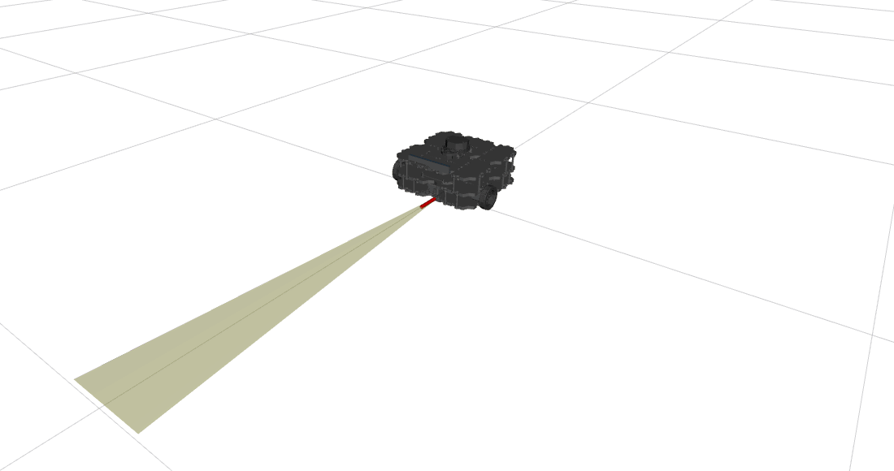
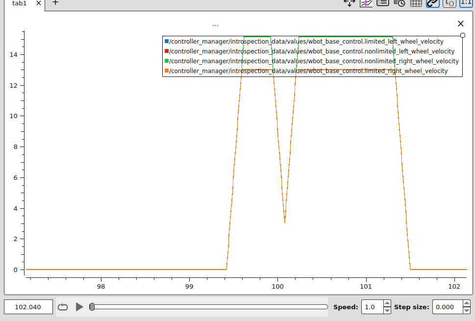
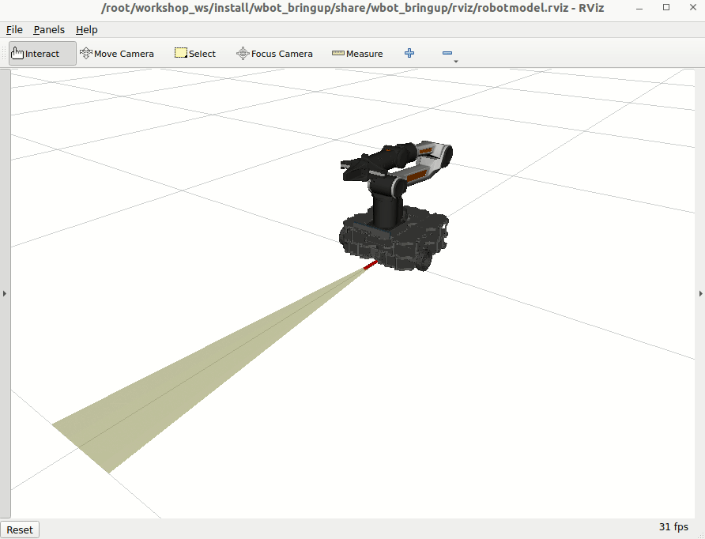
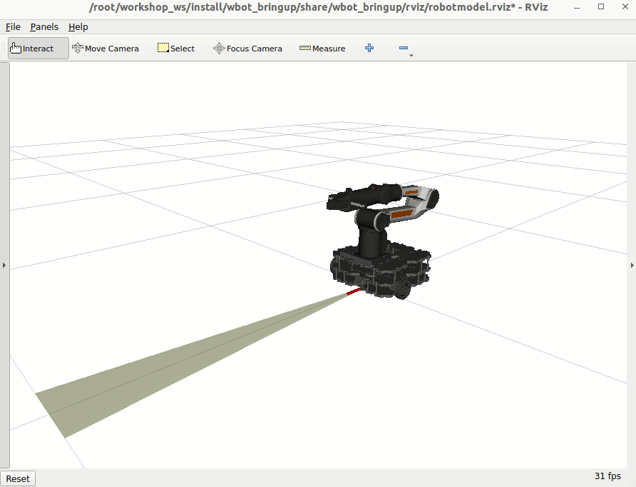
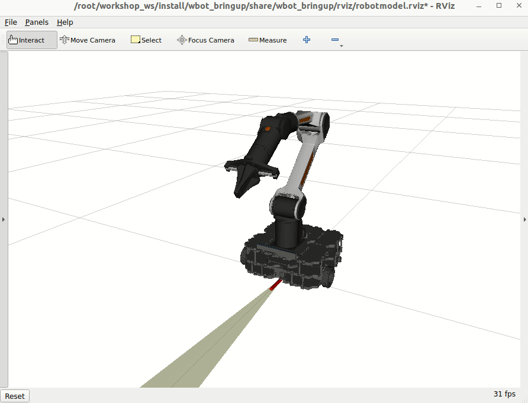

Please provide us ROSCon UK [feedback here](https://forms.gle/1QM9HWDUekFCRc7b7)

# ROSCon 2025 ros2_control Workshop

## Docker

### Prerequisite
1. Install [docker compose](https://docs.docker.com/compose/install/linux/#install-using-the-repository).

### Docker Pull
1. Clone this repo and navigate to the directory `<path of cloned repo>/zenoh_host`

1. Get the latest container build with `docker compose pull`

#### If pulling fails, build
1. Build the Docker image with: `docker compose build`

It is possible you cannot pull due to network access or using an architecture for which there is no build available online.

### Docker Run
1. To run applications that have a GUI inside Docker (i.e. Rviz or Plotjuggler) we have to allow access to the screen by running: `xhost +` on the host PC once per machine startup.

2. To start the container run:
```bash
cd <path of cloned repo>/zenoh_host
xhost + && docker compose up -d
```

3. To open an interactive shell to the running container run: `docker exec -it ros2_control_roscon25 bash`

Handy alias to add to the `.bashrc`:
```bash
echo 'alias rc="docker exec -it ros2_control_roscon25 bash"' >> ~/.bashrc
```

4. To verify you have the container up at any time, you can run `docker ps`, you should see something similar:
```bash
CONTAINER ID   IMAGE                                                     COMMAND                  CREATED        STATUS        PORTS     NAMES
47852bf550b2   ghcr.io/ros-controls/roscon2025_control_workshop:latest   "/ros_entrypoint.sh …"   1 hours ago   Up 1 hours             ros2_control_roscon25
```

## Task 1: Mock Hardware & Introspection


1. Once in the container, let's start the zenoh daemon: `z`. This is also an alias, don't worry.

2. Open a new terminal, `rc`, then in the new shell inside the container, run the launch file below. This will bring up `rviz` with a simulated robot in there.
```bash
ros2 launch wbot_bringup wbot.launch.xml
```

3. Open a new terminal, `rc`, let's open `rqt_graph` & inspect the results. Close `rqt_graph` but keep the terminal open.

4. Make sure `rviz` is visible, let's teleop this bot:
```bash
ros2 run teleop_twist_keyboard teleop_twist_keyboard --ros-args -p stamped:=true
```

5. Let's try the CLI tools too! Close the teleop tool and let's run a few commands
```bash
ros2 control list_controllers
ros2 control list_controller_types
ros2 control list_hardware_components -v
ros2 control list_hardware_interfaces
```

6. Close all terminals.

## Task 2: ESP32 bringup & Introspection

1. Take your ESP32 and plug a data-capable USB-C cable into the port labeled "COM" (see on the back).
2. Verify that the device shows up on your laptop. Open a new terminal and run `ls /dev/ttyACM*` or `ls /dev/ttyUSB*`. We have an alias in the container expecting `/dev/ttyACM0` but we can override it.
   - One of the best ways to know where your devices in mapped when connected to PC is to use `sudo dmesg -w` on your host system.
   - Then look for the line similar to:
     ```
     usb 3-4: FTDI USB Serial Device converter now attached to ttyUSB0
     ```
   - Then edit the alias in the your `~/.bashrc` file within the container and re-source it.
3. Go to the container now, `rc`, and `z` should start up the zenoh daemon with serial device support.
In case you have a different device path than `/dev/ttyACM0`, override it by running
```bash
echo "alias z='ZENOH_CONFIG_OVERRIDE=\"listen/endpoints=[\\\"tcp/[::]:7447\\\",\\\"serial//dev/YOUR_DEVICE_PATH#baudrate=460800\\\"]\" ros2 run rmw_zenoh_cpp rmw_zenohd'" >> /root/.bashrc
```
Now you can `source ~/.bashrc` and `z` should work fine. Since we won't take the container down, your setup should be fine for the rest of the day.
4. Let's inspect what we have running at the moment.
```bash
ros2 topic list
ros2 topic echo /picoros/joint_states
ros2 topic hz /picoros/joint_states
ros2 topic pub /picoros/joint_commands sensor_msgs/msg/JointState  '{name: ["wbot_wheel_left_joint", "wbot_wheel_right_joint", "dummy"], velocity: [1.0, 0.0, 0.0]}'
```

## Task 3: Hardware & Introspection

1. New terminal, `rc`, `z`
2. New terminal, `rc`,
```bash
ros2 launch wbot_bringup wbot.launch.xml mock_hardware:=false
```
Now let's introspect some more:

3. Let's inspect again. New terminal, `rc`.
```bash
rqt_graph
ros2 topic list
ros2 topic hz /joint_states
ros2 topic hz /picoros/joint_states
ros2 topic echo /joint_states
ros2 topic echo /picoros/joint_states
ros2 control list_controllers
ros2 control list_controller_types
ros2 control list_hardware_components -v
ros2 control list_hardware_interfaces
```

4. Let's drive it!
```bash
ros2 run teleop_twist_keyboard teleop_twist_keyboard --ros-args -p stamped:=true
```
Note how now you have some lag and the ESP32 board is firing off different colours based on the direction of driving!


At this stage, you are using a robot implementation running on the embedded board, controlled via your laptop. If you add wheels, you could drive it around now!

## Task 4: Let's look at the code of the hardware component & implement a limiter

[Let's review a PR implementing a limiter](https://github.com/ros-controls/topic_based_hardware_interfaces/pull/30)!
Good thing we already have this locally, let's test it!

1. New terminal, `rc`,
```bash
ros2 launch wbot_bringup wbot.launch.xml mock_hardware:=false enable_command_limiting:=true
```
2. Let's take a look at the ros2_control tag to remind ourselves of the configuration: `rc`,
```bash
cat src/wbot_description/urdf/wbot.ros2_control.xacro
```
3. Let's observe what happens when we drive the bot forward and backward now! New terminal, `rc`,
```bash
ros2 run teleop_twist_keyboard teleop_twist_keyboard --ros-args -p stamped:=true
```
4. The ESP32 LEDs also act weirdly when driving forward. Why is that?

Things to note:
* We added a new parameter to the hardware component
* We accessed elements of the hardware component configuration defined in the `<ros2_control>` tag.
* A call to `std::clamp` implements a simple limiter for commands sent down to the robot



## Task 5: Advanced introspection with pal_statistics

The code from the previous PR still applies.
[Let's review a PR implementing a limiter](https://github.com/ros-controls/topic_based_hardware_interfaces/pull/31)!
We'll reuse the limiting code for this task.

1. New terminal, `rc`,
```bash
ros2 launch wbot_bringup wbot.launch.xml mock_hardware:=false enable_command_limiting:=true
```
2. New terminal, `rc`,
```bash
ros2 topic echo /controller_manager/introspection_data/full
```
Look for `wbot_base_control.nonlimited` and `wbot_base_control.limited` and observe how they change as you drive around.

3. New terminal, `rc`,
```bash
ros2 run teleop_twist_keyboard teleop_twist_keyboard --ros-args -p stamped:=true
```

Things to note:
* We introduced new vectors to store non-limited and limited commands.
* We added an `on_configure()` method to the hardware component as this is the recommended place to call the introspection REGISTER macro and registered the new vectors in there.

This is obviously a toy example. The intended use-case for such introspection is to provide visibility into multi-step, complex computations, controller behaviour, hardware component internals, etc. Introspection-registered values could be anything that can be converted to a C++ double and are published at the rate of the `controller_manager` which is 100Hz for this workshop.

For convenience, here is a plot of the values before and after limiting. The non-limited values are what the `diff_drive_controller` produce and while the limited numbers are what our hardware component outputs to the ESP32 board.



## Task 6: Mixing mock and real hardware

Lets say we want to develop against our mobile base hardware but do not have access to a physical manipulator.
ros2_control makes this easy by allowing developers to choose which hardware instance is run per device at launch time.
For example you can see in [wbot_manipulator_macro.xacro](../zenoh_host/wbot_bringup/launch/wbot_manipulator.launch.xml#L25) I have hard coded the arm to always use mock hardware regardless of the xacro parameter `mock_hardware`.
This allows me to switch between simulating the diff drive base with mock or real hardware.

1. New terminal, `rc`, Launch the wbot_bringup with the `mock_hardware` argument set to `false`
```bash
ros2 launch wbot_bringup wbot_manipulator.launch.xml mock_hardware:=false
```
2. List the hardware components information: new terminal, `rc`,
```bash
ros2 control list_hardware_components
```

Where you can see `wbot_base_control` is now running the `JointStateTopicSystem` plugin to communicate with the embedded device.
```bash
Hardware Component 1
    name: wbot_arm_piper_control
    type: system
    plugin name: mock_components/GenericSystem
    state: id=3 label=active
    read/write rate: 100 Hz
    is_async: False
    command interfaces
        wbot_arm_joint_1/position [available] [claimed]
        wbot_arm_joint_2/position [available] [claimed]
        wbot_arm_joint_3/position [available] [claimed]
        wbot_arm_joint_4/position [available] [claimed]
        wbot_arm_joint_5/position [available] [claimed]
        wbot_arm_joint_6/position [available] [claimed]
        wbot_arm_gripper_joint/position [available] [claimed]
Hardware Component 2
    name: wbot_base_control
    type: system
    plugin name: joint_state_topic_hardware_interface/JointStateTopicSystem
    state: id=3 label=active
    read/write rate: 100 Hz
    is_async: False
    command interfaces
        wbot_wheel_left_joint/velocity [available] [claimed]
        wbot_wheel_right_joint/velocity [available] [claimed]
```

### Moving the robot
Now that we are running the base against it's "real" hardware interface and the arm is running the generic mock system we can ask them to move around and entire system should operate as if hardware were available to command and move.

### DiffDriveController
To drive the base around start a twist publisher that send commands to the `DiffDriveController` which calculates wheel velocity commands and sends them to the ESP embedded hardware.
```bash
ros2 run teleop_twist_keyboard teleop_twist_keyboard --ros-args -p stamped:=true
```
It moves just as it did before, data goes through to the ESP32 board and state information comes back.



### JointTrajectoryController
The `JointTrajectoryController` offers 2 different interfaces to move its joints.
There is an action interface where it takes [FollowJointTrajectory](https://github.com/ros-controls/control_msgs/blob/master/control_msgs/action/FollowJointTrajectory.action) action requests. (This is what MoveIt is configured to use by default)
```bash
ros2 action info /joint_trajectory_controller/follow_joint_trajectory
# Action: /joint_trajectory_controller/follow_joint_trajectory
# Action servers: 1
#     /joint_trajectory_controller
```
Or there is a topic command interface
```bash
ros2 topic info -v /joint_trajectory_controller/joint_trajectory
# Type: trajectory_msgs/msg/JointTrajectory
#
# Subscription count: 1
#
# Node name: joint_trajectory_controller
# Topic type: trajectory_msgs/msg/JointTrajectory

```

To test the topic interface lets send the arm to a different pose and give it a few seconds to get there.
```bash
ros2 topic pub /joint_trajectory_controller/joint_trajectory trajectory_msgs/JointTrajectory "{
  joint_names: [wbot_arm_joint_1, wbot_arm_joint_2, wbot_arm_joint_3, wbot_arm_joint_4, wbot_arm_joint_5, wbot_arm_joint_6, ],
  points: [
    { positions: [0.0, 0.85, -0.75, 0.0, 0.5, 0.0], time_from_start: { sec: 2 } },
  ]
}" -1
```

and back home
```bash
ros2 topic pub /joint_trajectory_controller/joint_trajectory trajectory_msgs/JointTrajectory "{
  joint_names: [wbot_arm_joint_1, wbot_arm_joint_2, wbot_arm_joint_3, wbot_arm_joint_4, wbot_arm_joint_5, wbot_arm_joint_6, ],
  points: [
    { positions: [0.0, 0.0, 0.0, 0.0, 0.0, 0.0], time_from_start: { sec: 1 } },
  ]
}" -1
```


### GripperActionController
The last controller that is running is there to open and close the gripper.
The `GripperActionController` takes action requests on the `/gripper_controller/gripper_cmd` topic where the target position can be specified.

Open:
```bash
ros2 action send_goal /gripper_controller/gripper_cmd control_msgs/action/ParallelGripperCommand "{command: {name: [wbot_arm_gripper_joint], position: [0.03]}}"
```
Closed:
```bash
ros2 action send_goal /gripper_controller/gripper_cmd control_msgs/action/ParallelGripperCommand "{command: {name: [wbot_arm_gripper_joint], position: [0.0]}}"
```




## Embedded projects:

These projects were developed as demonstrations for working with Zenoh Pico on the ESP32 and ROS.

#### [Sine Wave Twist Publisher](twist_publisher/README.md)

#### [Joint State Publisher](jointstate_publisher/README.md)

#### [Embedded Mobile Base](embedded_mobile_base/README.md)
