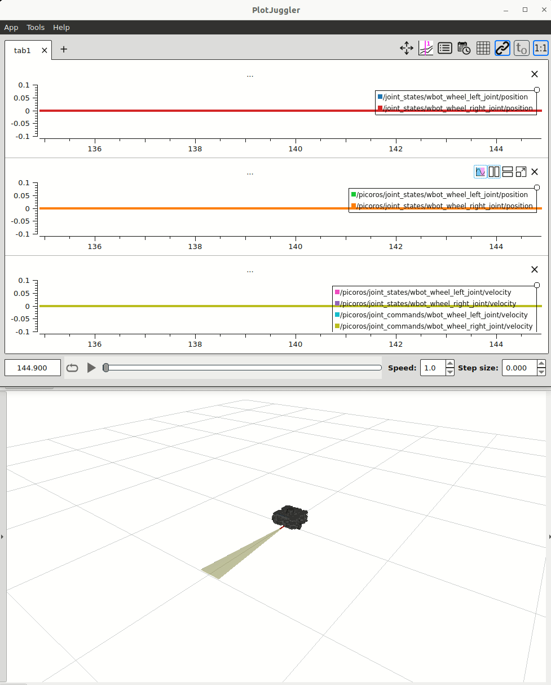

# Mobile Base Example

### Prerequisite
1. In VS Code use the `Open Folder` option to navigate to the `embedded-mobile-base` directory
1. Allow PlatformIO to download source based dependencies into the folder `.pio/libdeps/esp32-s3-devkitc-1/zenoh-pico` (this step happens automatically after you open the folder with the PlatformIO extension enabled)
1. Setup the 99-platformio-udev.rules as per the [instructions](https://docs.platformio.org/en/latest/core/installation/udev-rules.html#platformio-udev-rules)

```bash
curl -fsSL https://raw.githubusercontent.com/platformio/platformio-core/develop/platformio/assets/system/99-platformio-udev.rules | sudo tee /etc/udev/rules.d/99-platformio-udev.rules
sudo service udev restart
```

## Running the Example

1. Start and open an interactive shell to the Workshop container
```bash
docker exec -it ros2_control_roscon25 bash
```

2. Start the Zenoh router
```bash
ZENOH_CONFIG_OVERRIDE='listen/endpoints=["tcp/[::]:7447","serial//dev/ttyACM0#baudrate=460800"]' ros2 run rmw_zenoh_cpp rmw_zenohd
```

> [!NOTE]
> The port `/dev/ttyACM0` in the above `ZENOH_CONFIG_OVERRIDE` variable should correspond to the USB connected to the port COMM/UART on the ESP32 board.

You should see something like this in the output
```
2025-09-07T19:21:09.557554Z  INFO ThreadId(02) zenoh::net::runtime: Using ZID: a0a93e6969d215a11964e6a3bde24ff3
2025-09-07T19:21:09.558261Z  INFO ThreadId(02) zenoh::net::runtime::orchestrator: Zenoh can be reached at: tcp/[fe80::4a26:638c:e6fa:d033]:7447
2025-09-07T19:21:09.558266Z  INFO ThreadId(02) zenoh::net::runtime::orchestrator: Zenoh can be reached at: tcp/192.168.1.40:7447
2025-09-07T19:21:09.558267Z  INFO ThreadId(02) zenoh::net::runtime::orchestrator: Zenoh can be reached at: serial//dev/ttyACM0
Started Zenoh router with id a0a93e6969d215a11964e6a3bde24ff3
```

3. Follow the `Prerequisite` above and build the project with `Ctrl+Alt+B` then download the code to the device

4. Once the program starts on the ESP32 the
- LED will go solid blue to signal NVS init complete
- LED will go solid red to signal start of RMW init
- LED will switch to color output based on latest driving command

5. On the host open a second interactive terminal to the Workshop container and open rviz.
```bash
docker exec -it ros2_control_roscon25 bash
ros2 launch wbot_bringup wbot.launch.xml mock_hardware:=false
```

6. On the host open a third interactive terminal to the Workshop container and attempt to teleoperate the robot.
This will publish a Twist message on the `/cmd_vel` topic which is the same value the `DiffDriveController` is listening to for commands.
```bash
ros2 run teleop_twist_keyboard teleop_twist_keyboard --ros-args -p stamped:=true
```

7. (Optional) Run Plugjuggler UI to monitor the system and plot performance.
You can load the pre-configured layout included in [wbot_bringup](/zenoh_host/wbot_bringup/wbot_plotjuggler.xml)
```bash
ros2 run plotjuggler_plotjuggler
```



8. The ESP32's RGB LED will now change colors according to the latest driving command.
