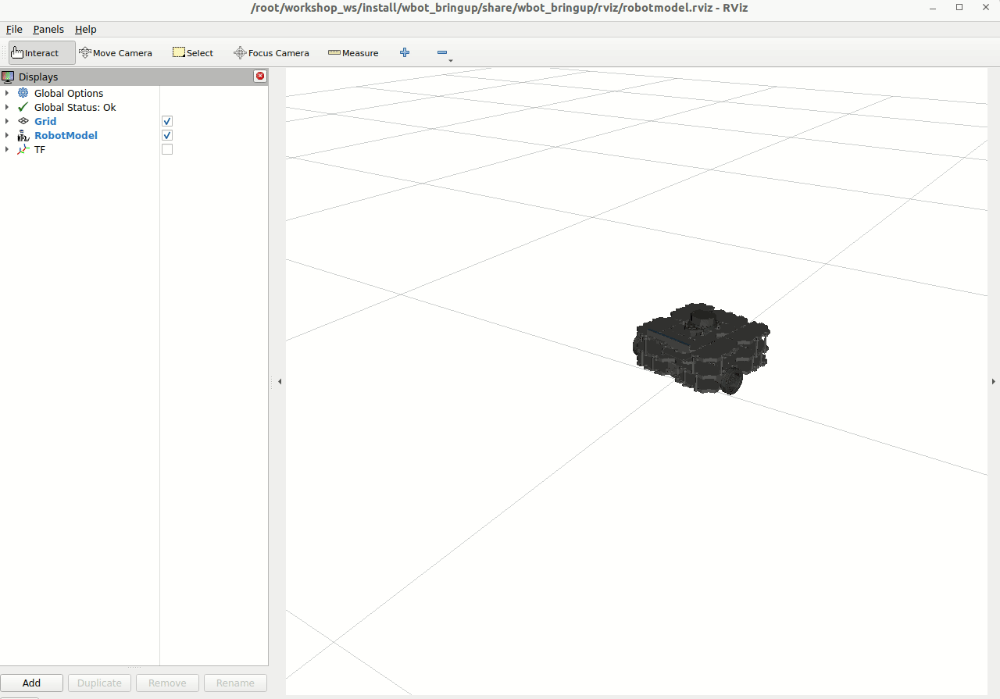

#### Example JointState Publisher

### Prerequisite
1. In VS Code use the `Open Folder` option to navigate to the `jointstate_publisher` directory
1. Allow PlatformIO to download `zenoh-pico` into the folder `.pio/libdeps/esp32-s3-devkitc-1/zenoh-pico` (this step happens automatically after you open the folder with the PlatformIO extension enabled)
1. Set up the local wifi access point
Create and configure access point:
```
nmcli dev wifi hotspot ssid "ros2_control_workshop_1" password "roscon2025" con-name "ros2_workshop_ap" && nmcli con modify ros2_workshop_ap ipv4.addresses 10.42.0.1/24 ipv4.method shared && nmcli con up ros2_workshop_ap
```
The access point name and password needs to match what you have set up in the embedded project. We use `SSID` and `PASS` for these and the IP address needs to match what's defined in `ROUTER_ADDRESS`.


## Running the Example

1. Start and open an interactive shell to the Workshop container
```bash
docker exec -it ros2_control_roscon25 bash
```

2. Start the Zenoh router and note the wireless IP address it is running on
```bash
ros2 run rmw_zenoh_cpp rmw_zenohd
```

You should see something like this in the output
```
2025-08-13T14:37:00.271196Z  INFO ThreadId(02) zenoh::net::runtime::orchestrator: Zenoh can be reached at: tcp/192.168.9.241:7447
```

3. Follow the `Prerequisite` above and build the project with `Ctrl+Alt+B` then download the code to the device

4. Once the program starts on the ESP32 the
- LED will start blinking Blue to indicate it is connecting to the WiFi
- Serial message should be printed though PlatformIO's Serial Monitor
- LED will start blinking Green after it has connected to to the Zenoh host and is publishing messages

5. On the host open a second interactive terminal to the Workshop container and open rviz. You'll see a turtlebot wiggling around on the floor.
```bash
docker exec -it ros2_control_roscon25 bash
ros2 launch wbot_bringup wbot.launch.xml mock_hardware:=false
```

6. Select `Start` in the Plugjuggler UI and select the `picoros/joint_states` topic to listen to and add the first two joints position data to the plot.
You can also load the pre-configured layout included in [wbot_bringup](/zenoh_host/wbot_bringup/wbot_plotjuggler.xml)

7. On the host open a third interactive terminal to the Workshop container and attempt to teleoperate the robot.
This will publish a Twist message on the `/cmd_vel` topic which is the same value the `DiffDriveController` is listening to for commands.

```bash
ros2 run teleop_twist_keyboard teleop_twist_keyboard --ros-args -p stamped:=true
```


