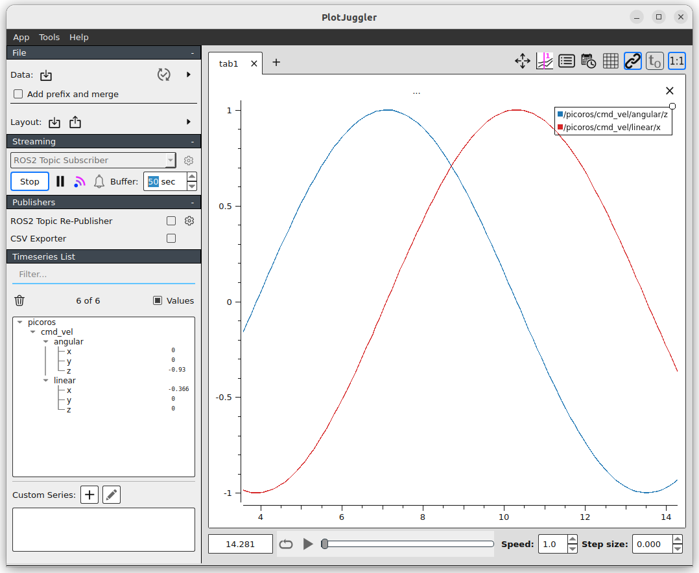

#### Sine Wave Twist Publisher

### Prerequisite
1. In VS Code use the `Open Folder` option to navigate to the `twist_publisher` directory
2. Allow PlatformIO to download source based dependencies into the folder `.pio/libdeps/esp32-s3-devkitc-1/zenoh-pico` (this step happens automatically after you open the folder with the PlatformIO extension enabled)
4. Install [python virtual env](https://docs.platformio.org/en/latest/faq/install-python.html) `sudo apt install python3-venv`.
5. Setup the 99-platformio-udev.rules as per the [instructions](https://docs.platformio.org/en/latest/core/installation/udev-rules.html#platformio-udev-rules)

```bash
curl -fsSL https://raw.githubusercontent.com/platformio/platformio-core/develop/platformio/assets/system/99-platformio-udev.rules | sudo tee /etc/udev/rules.d/99-platformio-udev.rules
sudo service udev restart
```

## Running the Example

1. Start and open an interactive shell to the Workshop container
```bash
docker exec -it ros2_control_roscon25 bash
```

2. Start the Zenoh router and note the wireless IP address it is running on
```bash
ZENOH_CONFIG_OVERRIDE='listen/endpoints=["tcp/[::]:7447","serial//dev/ttyACM0#baudrate=115200"]' ros2 run rmw_zenoh_cpp rmw_zenohd
```

> [!NOTE]
> The port `/dev/ttyACM0` in the above `ZENOH_CONFIG_OVERRIDE` variable should correspond to the USB connected to the port COMM/UART on the ESP32 board.

You should see something like this in the output
```
2025-09-07T19:21:09.557554Z  INFO ThreadId(02) zenoh::net::runtime: Using ZID: a0a93e6969d215a11964e6a3bde24ff3
2025-09-07T19:21:09.558261Z  INFO ThreadId(02) zenoh::net::runtime::orchestrator: Zenoh can be reached at: tcp/[fe80::4a26:638c:e6fa:d033]:7447
2025-09-07T19:21:09.558266Z  INFO ThreadId(02) zenoh::net::runtime::orchestrator: Zenoh can be reached at: tcp/192.168.1.40:7447
2025-09-07T19:21:09.558267Z  INFO ThreadId(02) zenoh::net::runtime::orchestrator: Zenoh can be reached at: serial//dev/ttyACM0
Started Zenoh router with id a0a93e6969d215a11964e6a3bde24ff3
```

3.  Follow the `Prerequisite` above and build the project with `Ctrl+Alt+B` then upload the code to the device with `Ctrl+Alt+U`

4. Once the program starts on the ESP32 the
- LED will start blinking `RED`, `GREEN` and `BLUE` at the startup
- LED in `YELLOW` color represents that it is waiting to connect to the RMW router.
- LED will start blinking `GREEN` after it has connected to to the Zenoh host and is publishing messages

5. On the host open a second interactive terminal to the Workshop container and open Plogjuggler
```bash
docker exec -it ros2_control_roscon25 bash
ros2 run plotjuggler plotjuggler
```

6. Select `Start` in the Plugjuggler UI and select the `picoros/cmd_vel` topic to listen to and add the `Linear.X` and `Angular.Z` data to the plot


